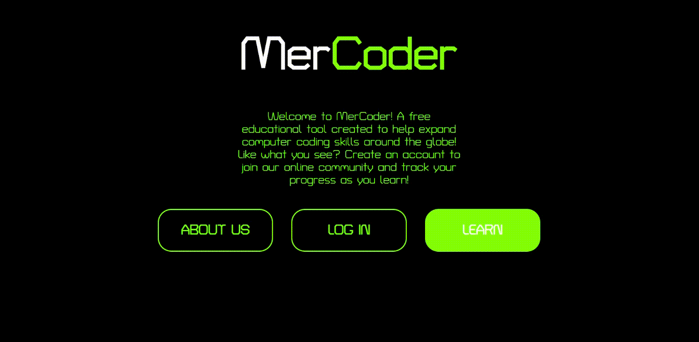

# MerCoder--An Educational Website

## Table of Contents
* [Introduction](#introduction)
* [Features](#features)
* [Setup and Execution](#setup-and-execution)

## Introduction
MerCoder is an interactive, educational website built to help anyone around the world learn computer science topics. This website was created for the semester long project portion of a Software Engineering class in Fall 2019 and will continue to be worked on throughout Spring 2020. 

## Features
The website uses HTML, CSS, and JavaScript. It was built using a XAMPP stack (Windows, Apache, MySQL, and PHP. 

MerCoder hosts computer science lessons that can be viewed by anyone, anywhere. The website comes with a variety of default lessons on many topics including Python, Pixlr, SVG, and Scratch. 

The main feature the site offers is an account system where users can make accounts to access their own personal profile and give them added functionality. There are three profile types: Student, Teacher and Administrator. 

The student profile will help them keep track of their progress on lessons and give them access to a global forum where they can ask and answer questions from other students working on the same lessons. 

The teacher profile will allow teachers to publish and modify their own lessons and also participate in answering forum questions. 

Administration accounts oversee the website; teacher accounts must be validated by Admin accounts.

## Setup and Execution
To view the MerCoder website, download the repository and double-click on "index.html" file. In order for the backend portion to work (PHP and database), the site should be opened on localhost through a server like Apache. 
